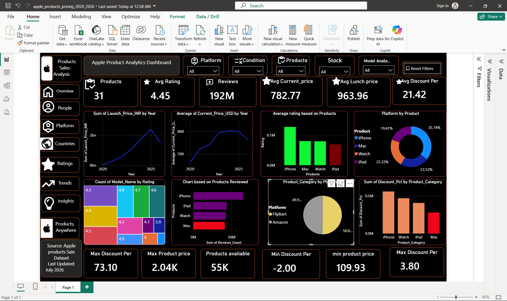

# 🍎 Apple Product Analytics Dashboard

An interactive **Power BI dashboard** analyzing Apple product pricing, ratings, reviews, discounts, stock availability, and product performance from **2020–2026**.

---

## 📊 Dashboard Preview

---

## 📌 Project Overview

This project provides an interactive Power BI dashboard that helps analyze Apple's product portfolio using multiple business metrics. It enables users to explore pricing trends, customer ratings, product reviews, discounts, stock availability, and platform distribution through dynamic filters and visualizations.

---

## 🎯 Objectives

- Analyze Apple product pricing trends
- Compare launch price and current price
- Monitor product ratings and customer reviews
- Analyze stock availability
- Compare products across platforms
- Identify discount patterns
- Create an interactive dashboard for business insights

---

## 📈 KPIs

- ✅ Total Products
- ⭐ Average Rating
- 💬 Total Reviews
- 💲 Average Current Price
- 🚀 Average Launch Price
- 🎁 Average Discount Percentage
- 📦 Total Products Available
- 📉 Minimum Product Price
- 📈 Maximum Product Price
- 🔥 Maximum Discount

---

## 📊 Dashboard Features

- Interactive slicers
- Dynamic KPI cards
- Year-wise pricing trend
- Product-wise analysis
- Platform comparison
- Product category analysis
- Rating distribution
- Discount analysis
- Review analysis
- Reset Filters button

---

## 🛠 Tools Used

- Power BI Desktop
- Power Query
- DAX
- Data Modeling
- GitHub

---

## 📂 Files Included

- `apple_products_pricing_2020_2026.pbix`
- `apple_products_pricing_2020_2026.csv`
- `dashboard.png`

---

## 💡 Key Insights

- iPhone has the highest overall product presence.
- Product prices increased over the years before declining slightly in the latest year.
- Customer ratings remain consistently high across products.
- Discount percentages vary significantly by product category.
- Reviews provide strong indicators of product popularity.
- Stock availability differs across product categories.

---

## 🚀 How to Use

1. Download the `.pbix` file.
2. Open it using Power BI Desktop.
3. Interact with slicers and charts.
4. Explore pricing, ratings, reviews, discounts, and stock insights.

---

## 👤 Author

**Ram Chauhan**

Aspiring Data Analyst | Power BI | SQL | Excel | Python

GitHub: https://github.com/rchauhan7676

---

## ⭐ If you found this project useful

Please consider giving this repository a ⭐ on GitHub.
